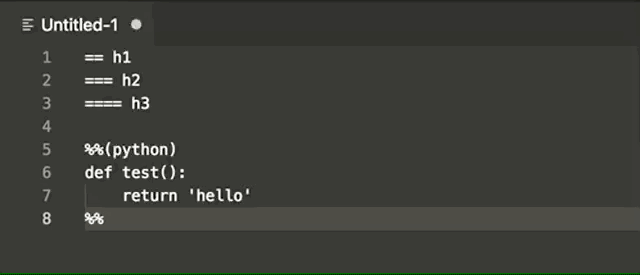
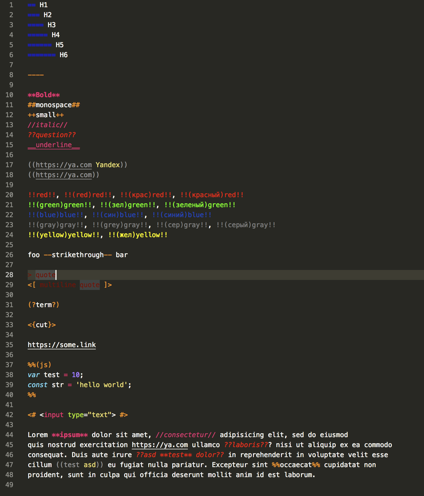
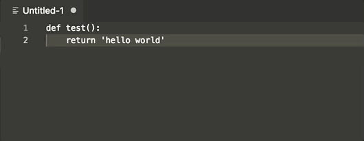
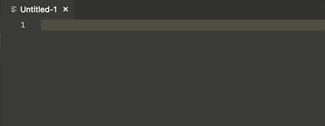

# vscode-yandex-wiki

Visual Studio Code syntax highlight and snippets for [Yandex.Wiki](https://yandex.ru/support/connect-wiki/static-markup.html?lang=en) markup. Markdown is support too!

## Highlight

Change language mode to activate highlight or add `.wiki` extension to the file.

Highlight example

Extension patch global `editor.tokenColorCustomizations` setting for correct highlighting. If you want use custom colors change it in `Settings -> User Settings -> editor.tokenColorCustomizations`.

## Snippets

All snippets support selection wrapping with `Insert Snippet` command.

Dynamic actions with postfix `_action` for best search.

### Headers

|    |           |
|----|-----------| 
| h1 | `==`      | 
| h2 | `===`     | 
| h3 | `====`    | 
| h4 | `=====`   | 
| h5 | `======`  | 
| h6 | `=======` | 

### Inline

|           |                    |
|-----------|--------------------| 
| bold      | `**text**`         | 
| italic    | `//text//`         | 
| underline | `__text__`         | 
| monospace | `##text##`         | 
| small     | `++text++`         | 
| question  | `??text??`         | 
| term      | `(?text?)`         |
| link      | `((url text))`     | 
| green     | `!!(green)text!!`  | 
| red       | `!!(red)text!!`    | 
| blue      | `!!(blue)text!!`   | 
| gray      | `!!(gray)text!!`   | 
| yellow    | `!!(yellow)text!!` | 

### Actions

|                |                                                 |
|----------------|-------------------------------------------------| 
| tree           | Pages in a cluster                              | 
| backLinks      | Pages that link to this page                    | 
| linkstree      | Pages that this page links to                   | 
| mypages        | Pages I own                                     | 
| mychanges      | Pages I edit                                    | 
| mywatchespages | Pages I'm subscribed to                         | 
| watchers       | Pages belonging to users subscribed to this one | 

### Other

|         |                  |
|---------|------------------| 
| quote   | `<[text]>`       | 
| rawHtml | `<#text#>`       | 
| cut     | `<{title text}>` | 
| divider | `----`           | 

